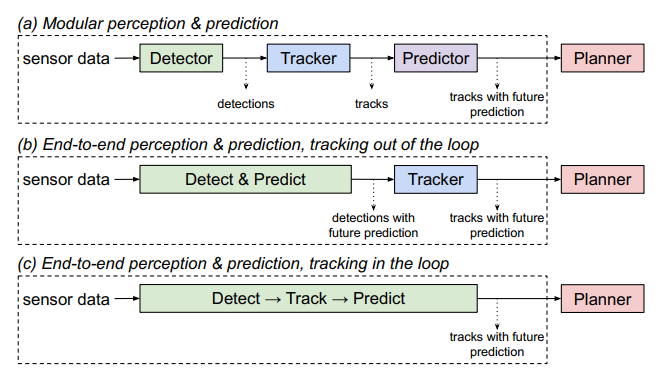
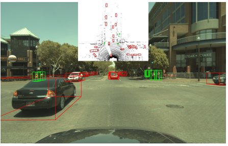
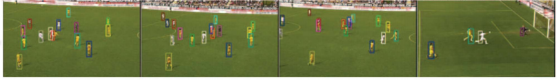
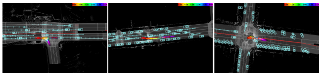
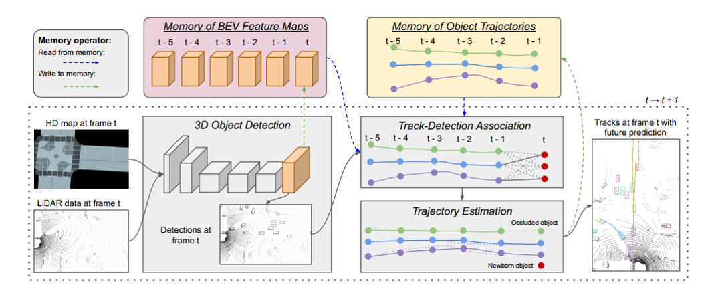
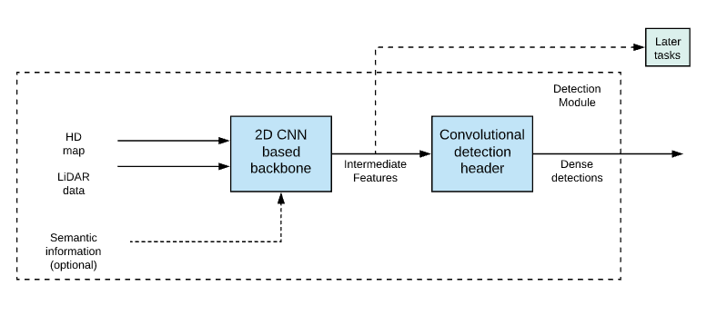

In this post, we will be looking at the paper [PnPNet: End-to-End Perception and Prediction with Tracking in the Loop](https://arxiv.org/abs/2005.14711), by *Liang et al.*,  which was published in CVPR 2020 [[1]](http://abyaadrafid.github.io/post/pnpnet/#1). After defining our task and discussing some related research in this field, we will be looking at the methodology of the paper. Then we will analyse the quantitative results and have a look at the qualitative results. Finally, we will finish it off with some remarks and possible ideas for extension.

# Introduction

In the context of self-driving vehicles, predicting the motion of other vehicles is a critical task. Approximating the trajectory of neighbouring agents in the future is equally as important as detecting them in the current time frame. To do this task, so far three paradigms have been proposed.

The first divides this problem into three separate sub-tasks, which are handled by completely independent sub-systems. These three tasks, namely, object detection, object tracking, and motion forecasting are done sequentially. As they are developed separately, they need more computing power and cannot correct mistakes from upstream tasks. The second paradigm  tries to solve the detection and prediction task with a single neural network. This yields more efficient computation but these models suffer from limited use of temporal history and are vulnerable to occlusion.

<figcaption>

Three paradigms of perception and prediction problems [[1]](http://abyaadrafid.github.io/post/pnpnet/#1)

</figcaption>

This paper introduces the new third paradigm. It argues that, for sequential modelling tasks such as motion forecasting, past data is very important. To that end, it proposes PnPNet which combines multi-object tracking with joint perception and prediction models. We will go into the details of the model after discussing some other works that try to tackle different aspects of our problem.

# Related works

### 3D object detection

The use of depth sensors such as LiDARs have been shown to have better performance [[2]](http://abyaadrafid.github.io/post/pnpnet/#2) than cameras for 3D detection. Some works also explore a fusion of LiDAR point clouds and camera inputs [[3]](http://abyaadrafid.github.io/post/pnpnet/#3).

<figcaption>

A qualitative result of fusion models [[3]](http://abyaadrafid.github.io/post/pnpnet/#3)

</figcaption>

### Multi-Object Tracking

Multi-Object tracking is a system to track multiple objects at the same time. It consists of a discrete data association problem and a continuous trajectory estimation problem [[4]](http://abyaadrafid.github.io/post/pnpnet/#4). There have been efforts to handle occlusion with hand crafted heuristics [[5]](http://abyaadrafid.github.io/post/pnpnet/#5) and single object tracking [[6]](http://abyaadrafid.github.io/post/pnpnet/#6) to handle occlusion. To handle the trajectory problem, some approaches also use sensor features but only use up to 3 seconds of temporal history [[7]](http://abyaadrafid.github.io/post/pnpnet/#7).

<figcaption>

An example of multi-object tracking takes from [[8]](http://abyaadrafid.github.io/post/pnpnet/#8)

</figcaption>

### Motion Forecasting

Different methods try to approach the multi agent motion forecasting problem. *Alahi et al.* propose lstm based social pooling to model motion [[9]](http://abyaadrafid.github.io/post/pnpnet/#9). Social-GAN [[10]](http://abyaadrafid.github.io/post/pnpnet/#10) improves on it using adversarial training. The use of sensor features are also explored, but these methods usually have generalization issues when applied to noisy data [[11]](http://abyaadrafid.github.io/post/pnpnet/#11).

### Joint models for Perception and Prediction

The FAF paper [[12]](http://abyaadrafid.github.io/post/pnpnet/#12) of *Luo et al.* serves as a direct predecessor and an evaluation baseline for PnPNet. This model uses a single convolutional backbone to detect and predict future motion. NeuralMP [[13]](http://abyaadrafid.github.io/post/pnpnet/#13) shares motion planning features with perception and prediction to allow end to end training.

<figcaption>

Some qualitative results from NeuralMP [[13]](http://abyaadrafid.github.io/post/pnpnet/#13)

</figcaption>

# Proposed method : PnPNet

### Technical Contributions

The discussed related research overlook an important aspect of our problem. The do not take temporal characteristics of actors into account. To allow for that, this paper makes two major technical contributions :
  1. It introduces a new trajectory representation based on a sequence of detections through time.
  2. It proposes a multi-object tracker that solves both the association and the trajectory estimation problem.

## Model Overview

PnPNet consists of three separate modules :
1. 3D Object detection module
2. Discrete-Continuous Tracking module
3. Motion forecasting module

<figcaption>

A summary of PnPNet workflow [[1]](http://abyaadrafid.github.io/post/pnpnet/#1)

</figcaption>

## 3D Object detection module

The detection module takes multi-sweep LiDAR point cloud representation in bird-eye-view and an HD map as input. Optionally, geometric and semantic information of the HD map can also be used. 2D convolutional neural network based backbone is applied to the input, which generates the intermediate BEV features that will be used in downstream tasks. A convolutional detection header is then used on the intermediate features to create dense object detections at each time step.

<figcaption>

Workflow of the 3D detection module

</figcaption>

## Discrete-Continuous Tracking module

Blah blah blah

## Motion Forecasting module

# References

[1] Ming Liang, Bin Yang, Wenyuan Zeng, Yun Chen, Rui Hu, Sergio Casas, Raquel Urtasun, "PnPNet: End-to-End Perception and Prediction with Tracking in the Loop", in CVPR, 2020.

[2] Bin Yang, Wenjie Luo, and Raquel Urtasun. Pixor: Realtime 3d object detection from point clouds. In CVPR, 2018.

[3] Ming Liang, Bin Yang, Shenlong Wang, and Raquel Urtasun. Deep continuous fusion for multi-sensor 3d object detection. In ECCV, 2018.

[4] Anton Milan, Konrad Schindler, and Stefan Roth. Multitarget tracking by discrete-continuous energy minimization. TPAMI, 38(10):2054–2068, 2015

[5] Hasith Karunasekera, Han Wang, and Handuo Zhang. Multiple object tracking with attention to appearance, structure, motion and size. IEEE Access 7:104423–104434, 2019.

 
[6] Peng Chu and Haibin Ling. Famnet: Joint learning of feature, affinity and multi-dimensional assignment for online multiple object tracking. In ICCV, 2019.

[7] Wenwei Zhang, Hui Zhou, Shuyang Sun, Zhe Wang, Jianping Shi, and Chen Change Loy. Robust multi-modality multi-object tracking. In ICCV, 2019.

[8] Michael D Breitenstein, Fabian Reichlin, Bastian Leibe, Esther Koller-Meier, and Luc Van Gool. Online multiperson tracking-by-detection from a single, uncalibrated camera. TPAMI, 33(9):1820–1833, 2010.

[9] Alexandre Alahi, Kratarth Goel, Vignesh Ramanathan, Alexandre Robicquet, Li Fei-Fei, and Silvio Savarese. Social lstm: Human trajectory prediction in crowded spaces. In CVPR, 2016.

[10] Agrim Gupta, Justin Johnson, Li Fei-Fei, Silvio Savarese, and Alexandre Alahi. Social gan: Socially acceptable trajectories with generative adversarial networks. In CVPR, 2018.

[11] Nicholas Rhinehart, Rowan McAllister, Kris Kitani, and Sergey Levine. Precog: Prediction conditioned on goals invisual multi-agent settings. In ICCV, 2019. 

[12] Wenjie Luo, Bin Yang, and Raquel Urtasun. Fast and furious: Real time end-to-end 3d detection, tracking and motion forecasting with a single convolutional net. In CVPR, 2018.

[13] Wenyuan Zeng, Wenjie Luo, Simon Suo, Abbas Sadat, Bin Yang, Sergio Casas, and Raquel Urtasun. End-to-end interpretable neural motion planner. In CVPR, 2019.

