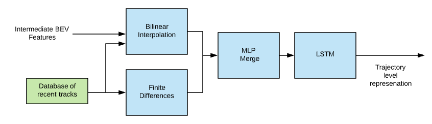
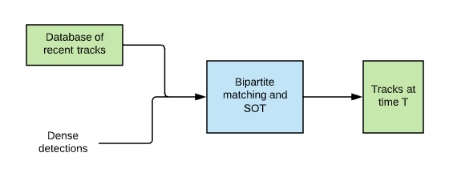
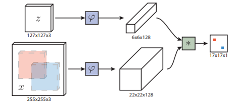
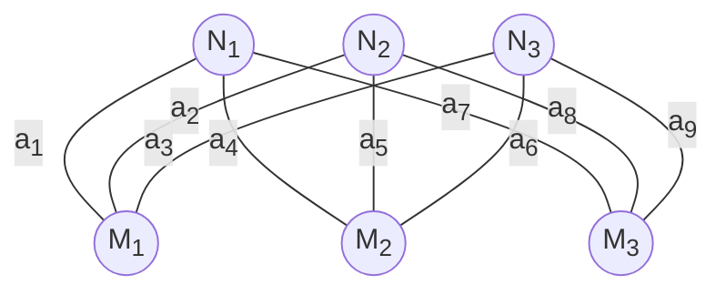
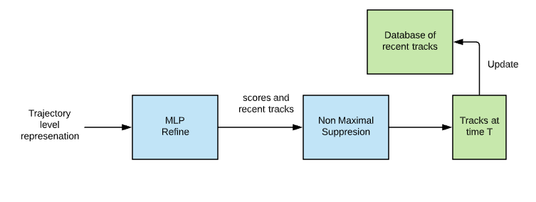
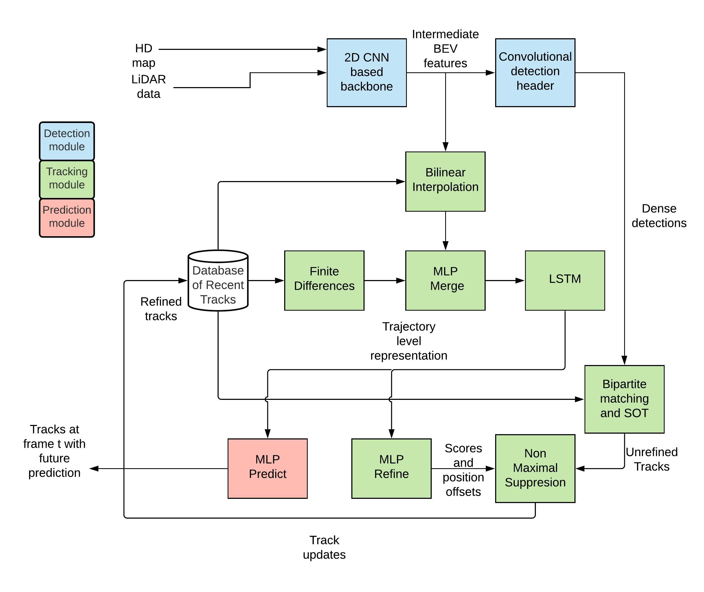
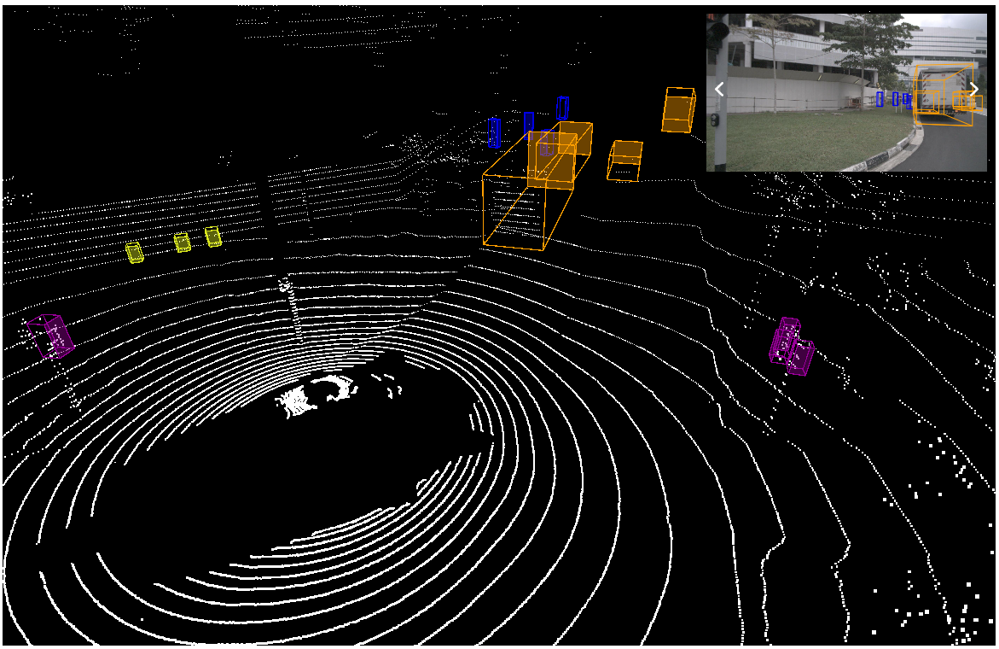
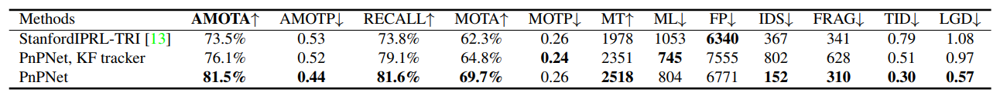
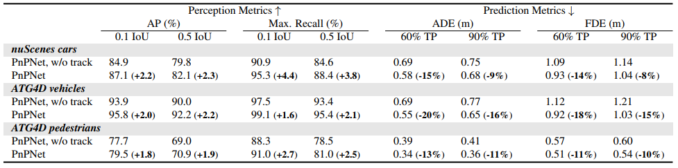
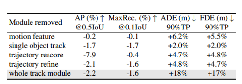

In this post, we will be looking at the paper [PnPNet: End-to-End Perception and Prediction with Tracking in the Loop](https://arxiv.org/abs/2005.14711), by *Liang et al.*,  which was published in CVPR 2020 [[1]](#1). After defining our task and discussing some related research in this field, we will be looking at the methodology of the paper. Then we will analyze the quantitative results and have a look at the qualitative results. Finally, we will finish it off with some remarks and possible ideas for extension.

# Introduction

In the context of self-driving vehicles, predicting the motion of other vehicles is a critical task. Approximating the trajectory of neighboring agents in the future is equally as important as detecting them in the current time frame. To do this task, so far three paradigms have been proposed.

The first divide this problem into three separate sub-tasks, which are handled by completely independent sub-systems. These three tasks, namely, object detection, object tracking, and motion forecasting are done sequentially. As they are developed separately, they need more computing power and cannot correct mistakes from upstream tasks. The second paradigm tries to solve the detection and prediction task with a single neural network. This yields more efficient computation but these models suffer from limited use of temporal history and are vulnerable to occlusion.

<figcaption>

Three paradigms of perception and prediction problems [[1]](#1)

</figcaption>

This paper introduces the new third paradigm. It argues that, for sequential modeling tasks such as motion forecasting, past data is very important. To that end, it proposes PnPNet which combines multi-object tracking with joint perception and prediction models. We will go into the details of the model after discussing some other works that try to tackle different aspects of our problem.

# Related works

### 3D object detection

The use of depth sensors such as LiDARs has been shown to have better performance [[2]](#2) than cameras for 3D detection. Some works also explore a fusion of LiDAR point clouds and camera inputs [[3]](#3).

<figcaption>

A qualitative result of fusion models [[3]](#3)

</figcaption>

### Multi-Object Tracking

Multi-Object tracking is a system to track multiple objects at the same time. It consists of a discrete data association problem and a continuous trajectory estimation problem [[4]](#4). There have been efforts to handle occlusion with hand-crafted heuristics [[5]](#5) and single object tracking [[6]](#6) to handle occlusion. To handle the trajectory problem, some approaches also use sensor features[[7]](#7).

<figcaption>

An example of multi-object tracking takes from [[8]](#8)

</figcaption>

### Motion Forecasting

Different methods try to approach the multi-agent motion forecasting problem. *Alahi et al.* propose LSTM based social pooling to model motion [[9]](#9). Social-GAN [[10]](#10) improves on it using adversarial training. The use of sensor features is also explored, but these methods usually have generalization issues when applied to noisy data [[11]](#11). Raster representation in BEV that encodes both perception and map information is widely used as well [[2]](#2).

### Joint models for Perception and Prediction

The FAF paper [[12]](#12) of *Luo et al.* serves as a direct predecessor and an evaluation baseline for PnPNet. This model uses a single convolutional backbone to detect and predict future motion. NeuralMP [[13]](#13) shares motion planning features with perception and prediction to allow end-to-end training.

<figcaption>

Some qualitative results from NeuralMP [[13]](#13)

</figcaption>

### Motivations for the approach

Research efforts in this sector have developed the field of autonomous driving a lot. However, they also have some shortcomings. Multi-object tracking with supplementary sensor readings can not effectively use a long history of temporal data. These models saturate after three seconds [[7]](#7). Also most-multi object tracking efforts only tackle one of the two tasks at a time. 

Although earlier joint models for perception and prediction use sensor information, they do not exploit the salient features of actors in the time dimension. As a result, their overall performance might be vastly improved with some adjustments. 

As we will see, PnPNet does exactly that. Where earlier models kept the tracking task at the end of the task stack, PnPNet pulls it inside the perception-prediction loop. By doing that, it can utilize trajectory-level representation and can improve performance in all related tasks. It also solves the discrete-continuous tracking problem that other works overlook with a novel tracking framework. PnPNet deviates from the common approach of [[2]](#2) and directly uses perception features for better scene contexts.

# Proposed method: PnPNet

### Technical Contributions

The discussed related research overlook an important aspect of our problem. They do not take the temporal characteristics of actors into account. To allow for that, this paper makes two major technical contributions :
  1. It introduces a new trajectory representation based on a sequence of detections through time.
  2. It proposes a multi-object tracker that solves both the association and the trajectory estimation problem.

# Model Overview

PnPNet consists of three separate modules :
1. 3D Object detection module
2. Discrete-Continuous Tracking module
3. Motion forecasting module

<figcaption>

A summary of PnPNet workflow [[1]](#1)

</figcaption>

## 3D Object detection module

The detection module takes multi-sweep LiDAR point cloud representation in birds-eye-view and an HD map as input. Optionally, geometric and semantic information of the HD map can also be used. 2D convolutional neural network-based backbone with multi-scale feature fusion is applied to the input, which generates the intermediate BEV features. A convolutional detection header is then used on the intermediate features to create dense object detections at each time step. We maintain a database of intermediate features at each time step because they will be needed to in the tracking module downstream.

<figcaption>

Workflow of the 3D detection module

</figcaption>

## Discrete-Continuous Tracking module

As discussed in the related works, there are two separate challenges in multi-object tracking. Previous works mostly focus on the discrete problem of data association but PnPNet also takes the continuous problem of trajectory estimation into account. The paper argues that it helps to prevent association errors from accumulating over time and reduces the variance in motion history. To that end, it proposes a two-stage tracking framework. To use the framework, rich and concise trajectory level object representation needs to be learned. 

<figcaption>

Trajectory level representation generation

</figcaption>

The representation learning problem is formulated as a sequence modeling problem. We use the intermediate FEV features from the backbone network and the location information of each object at time t to run a Bilinear Interpolation. Note that the location information is obtained from a database of older trajectories. This output is regarded as the representation of the motion of each object from the start frame to the current frame. Along with this, the absolute velocities of each object are passed into an MLP/feed-forward network. 

The merged features from this FF network are then used as the sequential input for our LSTM. This LSTM hidden state is our trajectory level representation at each time step.

### Data Association

The first stage of the tracking framework is the discrete tracker. We obtain the dense detections from the 3D detection module upstream and the trajectories from the database of older tracks. At time t, given Nt detections and Mt-1 trajectories, it tries to determine the associations between them. This association problem is formulated as a bipartite graph matching problem. As a result, one-to-one matching is guaranteed. The edge values for our bipartite matching problem are the affinity values, which represent how likely is a track Mt-1 to belong to detection Nt. The affinity matrix :
$$
 C_{i,j} =
    \begin{cases}
      MLP_{pair}(f(D_{i}^t); h(P_{j}^{t−1})) & if\ 1 ≤ j ≤ M_{t−1}\\\\
      MLP_{unary}(f(D_{i}^t)) & if\ j = M_{t−1} + i \\\\
      −inf & otherwise \\\\
    \end{cases}       
$$
The affinity values are calculated with binary or unary MLPs. If we have more or equal number of tracks at the previous step than detections at this step, we use the binary MLP. Otherwise, the unary MLP is used. This bipartite system is solved optimally using the Hungarian algorithm. We use single object tracking for older unmatched tracks. Combining results from bipartite matching and SOT yields a final set of unrefined tracks Pt. This set of unrefined tasks have the candidates for updating the database of older tracks to be used in the future time steps.

<figcaption>

Associating tracks with detections

</figcaption>

#### Single object tracking
The single object tracker used in the PnPNet paper follows nearly the same methodology as the Siamese tracker [[14]](#14). The Siamese tracker has two networks. One of these twin networks receives an exemplar image as input, another one receives a search image as input. The task for the twin network is to try and find the exemplar image within the search image.

<figcaption>

Siamese tracker from [[14]](#14).

</figcaption>

Siamese trackers usually have a cross-correlation layer at the end. PnPNet chooses to replace this layer with an MLP with learnable parameters.

#### Hungarian Algorithm

The Hungarian algorithm is an optimization algorithm that produces the best one-to-one matching when applied to a bipartite graph. In our context, two sets of nodes are the detections and the tracks, denoted as **N** and **M** respectively. The edges between these sets of nodes are the affinity values, denoted by **a**. Here we see an example formulation :

Hungarian algorithm will find the best matching that maximizes the overall affinity value throughout the graph.

### Trajectory Estimation

Trajectory estimation is the second stage in our two-stage tracking network. This module re-evaluates each object track for the new observation at the current frame and helps minimize false positives and localization errors from upstream tasks. The LSTM representation is refined by an MLP according to the current association. The MLP outputs a confidence score and center position offset. 
$$
  score_{i}, \Delta u_{i}^{t-T_0+1:t}, \Delta v_{i}^{t-T_0+1:t} = MLP_{refine}(h(P_{i}^t))
$$
Using these confidence scores, a non-maximal suppression is applied and only top Mt out of Pt tracks are accepted. Other tracks are discarded as false positives. The database of trajectories is then updated with this accepted tracks set. 

<figcaption>

Trajectory estimation sub-module.

</figcaption>

## Motion Forecasting module

Earlier joint perception and prediction models design the prediction module as another convolutional header. However, PnPnet puts tracking on the detection backbone and creates object trajectory representation as LSTM hidden states. These hidden states are then passed through an MLP to estimate motion prediction for each object we are tracking in each time step. 
$$
  \Delta u_{i}^{t:t+\Delta T}, \Delta v_{i}^{t:t+\Delta T} = MLP_{refine}(h(P_{i}^t))
$$
Here $\Delta T$ is a parameter of the model that denotes the prediction horizon. 

## End-to-End Training

As the model has a lot of moving parts, it is hard to visualize how the individual modules interact with each other. So here is an illustration that summarizes the workflow:

<figcaption>

Each rectangular box represents a major process. These boxes are color coded according to their individual modules. A database of tracks is represented with the cylindrical icon.

</figcaption>

As we can see from the figure, PnPNet only has one set of inputs and one set of outputs. This means it can be trained end-to-end.

To train PnPNet end-to-end, a multi-task loss is calculated from the individual losses of its three modules. 
$$
  L = L_{detect}+ L_{track} + L_{predict}
$$
Here the detection loss is the cross-entropy loss and the smoothed l1 loss over bounding boxes. The tracking loss is again another multi-task loss defined as : 
$$
  L_{track} = L_{score}^{affinity} + L_{score}^{sot} + L_{score}^{refine} + L_{reg}^{refine}
$$
The max-margin loss is applied to the sot scores, the trajectory scores, and the affinity matrix.
$$
  L_{score} = \frac{1}{N_{i,j}} \sum_{i \epsilon{pos}, j \epsilon{neg}} max(0, m − (a_i − a_j))
$$
Here Ni,j is the total number of positive and negative pairs, where ai and aj are scores for positive and negative samples accordingly. 

For the prediction task, the loss is just the smoothed l1 loss of the predictions. 

The Adam optimizer is used to train PnPNet with a frame rate of 10Hz. At each frame maximum M = 50 tracks and N = 50 detections are maintained. The prediction horizon is set $\Delta T$= 3 seconds with 0.5 seconds interval. 

# Datasets and Metrics

The PnPNet paper tests itself on two major driving datasets. The performance of PnPNet is measured from modular metrics of detection and tracking, as well as from system metrics for end-to-end perception and prediction.

### nuScenes Dataset [[15]](#15)

This dataset consists of 1000 20-seconds long log snippets with LiDAR sweeps and 3D labels for objects and corresponding HD maps. Although this dataset has some caveats because it only has 84 unique driving journeys, and 63.5% of the cars are parked.

<figcaption>

  An example from nuScences [[15]](#15)

</figcaption>

### ATG4D Dataset [[16]](#16)

To simulate real-world driving scenario, the authors validate PnPNet on the ATG4D dataset. It contains over 5000 log snippets of 1000 unique journeys. Each snippet with LiDAR sweeps and HD maps. Also, only 48.1% of the cars are parked. 
### Modular Metrics

For detection and tracking tasks, PnPNet follows tracking metrics introduced by nuScenes [[15]](#15). Detection task is measured in terms of average precision (AP) and tracking task in terms of MOT metrics, defined by *Bernardin et al.*[[17]](#17).
### System Metrics

Unlike predefined modular metrics, system metrics are defined by the PnPNet paper itself. For the perception task, average precision and maximum recall are used. For the prediction task, PnPNet uses average displacement error (ADE) and final displacement error (FDE). Both of these displacement errors are measured over 3 seconds, with ADE over a 0.5-second interval. Displacement error is simply the difference between the actual and the predicted location of an object. 

# Results

In this section, we look at the quantitative results, some ablation studies, and some qualitative results on PnPnet. 
## Quantitative results

### Detection and tracking

The detection module is evaluated on nuScenes in comparison to other SOA detections. PnPnet outperforms leading model *Megvii*[[18]](#18) in most metrics. The tracking module is evaluated against the leading approach *StanfordIPRL-TRI*[[19]](#19) and a PnPNet baseline with KF tracker replacing the tracking module. PnPnet outperforms [[19]](#19) and KF tracker in MOT metrics. 

<figcaption>

  Evaluation of multi object tracking on nuScenes [[1]](#1)

</figcaption>

Even though there are not many significant changes in the object detection module, PnPNet being an end-to-end model benefits this task too. A Better prediction model also fine-tunes the detection module. Improvements in the tracking model then influence the prediction task. 

### Perception and prediction

PnPnet is evaluated on both nuScenes and ATG4D for end-to-end perception and prediction. The paper establishes a baseline by removing the tracking module and denotes it as "PnPnet w/o track". This implementation can be considered a re-implementation of [[12]](#12). The fast and furious (FAF)[[12]](#12) is the direct predecessor of PnPNet. Classic PnPNet outperforms this baseline consistently across both datasets and all metrics, illustrating that keeping tracking in the loop allows for massive improvements in all tasks. 

<figcaption>

  End-to-End results on ATG4D and nuScenes [[1]](#1)

</figcaption>

PnPNet observes up to 4.4 and 2.3 percentage increase in average precision and maximum recall respectively. For the prediction task, ADE is decreased up to 20% and FDE up to 15%.

## Ablation studies

Ablation studies are often conducted on end-to-end models to find out the individual contributions to the final result. PnPNet paper also conducts some ablation studies by removing motion features, sot, trajectory refinement, and the whole track module one byone. 

<figcaption>

  Ablation studies on PnPNet [[1]](#1)

</figcaption>

From the results of the studies, it is obvious that the tracking module has the largest effect on the prediction results. ADE and FDE go up to 18% percent in the absence of the tracking module. The trajectory rescore module influences average precision and displacement errors. The single object tracking module has a decent contribution across all the metrics. 

## Qualitative Results

Well, these explanations are good and all but, where are the tangible results? Let's look at the visualization of perception and prediction results on ATG4D. This demonstrates that by learning trajectory representations explicitly, PnPNet is able to handle occlusion and produces robust predictions.



<figcaption>

  Qualitative results of  [[1]](#1)
  
</figcaption>

This video was taken from the CVF youtube channel. The original video was the presentation for the PnPNet paper, which can be found [here](https://www.youtube.com/watch?v=3dsXqhICdI8&ab_channel=ComputerVisionFoundationVideos).

# Summary

Earlier works in the realm of perception and prediction of autonomous driving have somewhat overlooked the contribution of trajectory information for future predictions. Although recent works do capitalize on the use of joint models, they leave tracking out of the loop. Following the footstep of these recent developments, PnPNet proposes a novel end-to-end training framework for perception and prediction while taking tracking into consideration. They also introduce a new tracking framework that can be looped into classic detection-prediction stacks. Their proposed improvements are then validated on different datasets and compared with other leading models in this paradigm. Finally, they show significant improvement in all three tasks as well as end-to-end performance.  

## Personal Remarks

* In the paper, the authors assume the maximum number of detection and tracks to be 50. But, on busy roads usually there are far more moving objects within close proximity. The only way for PnPNet to consider this is to increase the *N* and *M* parameters. However, this again results in a massive number of computations for the Hungarian algorithm. The paper doesn't take this problem into account.
* The authors only store tracks up to 16 older frames to maintain real-time performance. However, ablation studies show that, keeping tracks up to 32 frames achieves better prediction result. This points to the fact that this model has some performance-efficiency trade-off.
* The predecessor of PnPNet, FaF[[12]](#12) did not have an explicit tracking module, but still outperformed the Hungarian matching. PnPNet, however, incorporates the Hungarian algorithm in it's design and outperforms FaF. We can posit that continuous track refinement has helped in the association task as well. 
* PnPNet uses an LSTM unit in the tracking module. However, as we know LSTMs need quite a bit of computation resources. In future works, other less expensive recurrent units can be explored for the same task. For example, GRU units [[20]](#20) are computationally less expensive and have been proven to be comparable in terms of performance [[21]](#21).
* Recently many sequence modeling tasks are leveraging the attention mechanism. As we define our tracking as a sequential problem, it may be useful to apply self-attention on top of the recurrent unit outputs. Although this is not a pure sequence problem, self-attention may refine and provide importance to better trajectory features. Also, built-in attention [[22]](#22) can be applied to the 2D-Convolutional backbone of the 3D detection algorithm.

# References

[1] Ming Liang, Bin Yang, Wenyuan Zeng, Yun Chen, Rui Hu, Sergio Casas, Raquel Urtasun, "PnPNet: End-to-End Perception and Prediction with Tracking in the Loop", in CVPR, 2020.

[2] Bin Yang, Wenjie Luo, and Raquel Urtasun. Pixor: Realtime 3d object detection from point clouds. In CVPR, 2018.

[3] Ming Liang, Bin Yang, Shenlong Wang, and Raquel Urtasun. Deep continuous fusion for multi-sensor 3d object detection. In ECCV, 2018.

[4] Anton Milan, Konrad Schindler, and Stefan Roth. Multitarget tracking by discrete-continuous energy minimization. TPAMI, 38(10):2054–2068, 2015

[5] Hasith Karunasekera, Han Wang, and Handuo Zhang. Multiple object tracking with attention to appearance, structure, motion and size. IEEE Access 7:104423–104434, 2019.

 
[6] Peng Chu and Haibin Ling. Famnet: Joint learning of feature, affinity and multi-dimensional assignment for online multiple object tracking. In ICCV, 2019.

[7] Wenwei Zhang, Hui Zhou, Shuyang Sun, Zhe Wang, Jianping Shi, and Chen Change Loy. Robust multi-modality multi-object tracking. In ICCV, 2019.

[8] Michael D Breitenstein, Fabian Reichlin, Bastian Leibe, Esther Koller-Meier, and Luc Van Gool. Online multiperson tracking-by-detection from a single, uncalibrated camera. TPAMI, 33(9):1820–1833, 2010.

[9] Alexandre Alahi, Kratarth Goel, Vignesh Ramanathan, Alexandre Robicquet, Li Fei-Fei, and Silvio Savarese. Social lstm: Human trajectory prediction in crowded spaces. In CVPR, 2016.

[10] Agrim Gupta, Justin Johnson, Li Fei-Fei, Silvio Savarese, and Alexandre Alahi. Social gan: Socially acceptable trajectories with generative adversarial networks. In CVPR, 2018.

 
[11] Nicholas Rhinehart, Rowan McAllister, Kris Kitani, and Sergey Levine. Precog: Prediction conditioned on goals invisual multi-agent settings. In ICCV, 2019. 

[12] Wenjie Luo, Bin Yang, and Raquel Urtasun. Fast and furious: Real time end-to-end 3d detection, tracking and motion forecasting with a single convolutional net. In CVPR, 2018.

[13] Wenyuan Zeng, Wenjie Luo, Simon Suo, Abbas Sadat, Bin Yang, Sergio Casas, and Raquel Urtasun. End-to-end interpretable neural motion planner. In CVPR, 2019.

[14]  Luca Bertinetto, Jack Valmadre, Joao F Henriques, Andrea Vedaldi, and Philip HS Torr. Fully-convolutional siamese networks for object tracking. In ECCV, 2016.

[15] Holger Caesar, Varun Bankiti, Alex H. Lang, Sourabh Vora, Venice Erin Liong, Qiang Xu, Anush Krishnan, Yu Pan, Giancarlo Baldan, and Oscar Beijbom. nuscenes: A multimodal dataset for autonomous driving. In CVPR, 2020.

[16] Bin Yang, Wenjie Luo, and Raquel Urtasun. Pixor: Realtime 3d object detection from point clouds. In CVPR, 2018.

[17] Keni Bernardin, Alexander Elbs, and Rainer Stiefelhagen. Multiple object tracking performance metrics and evaluation in a smart room environment. In Sixth IEEE International Workshop on Visual Surveillance, in conjunction with ECCV, 2006. 

[18] Benjin Zhu, Zhengkai Jiang, Xiangxin Zhou, Zeming Li, and Gang Yu. Class-balanced grouping and sampling for point cloud 3d object detection. arXiv preprint arXiv:1908.09492, 2019

[19] Hsu-kuang Chiu, Antonio Prioletti, Jie Li, and Jeannette Bohg. Probabilistic 3d multi-object tracking for autonomous driving. arXiv preprint arXiv:2001.05673, 2020.

[20] Kyunghyun Cho, Bart van Merrienboer, Caglar Gulcehre, Dzmitry Bahdanau, Fethi Bougares, Holger Schwenk, Yoshua Bengio. Learning Phrase Representations using RNN Encoder-Decoder for Statistical Machine Translation, In EMNLP 2014.

[21] Junyoung Chung, Caglar Gulcehre, KyungHyun Cho, Yoshua Bengio. Empirical Evaluation of Gated Recurrent Neural Networks on Sequence Modeling. In NIPS 2014 Deep Learning and Representation Learning Workshop.

[22] Niamul Quader, Md Mafijul Islam Bhuiyan, Juwei Lu, Peng Dai,and Wei Li. Weight Excitation: Built-in Attention Mechanisms in Convolutional Neural Networks. In ECCV 2020.

