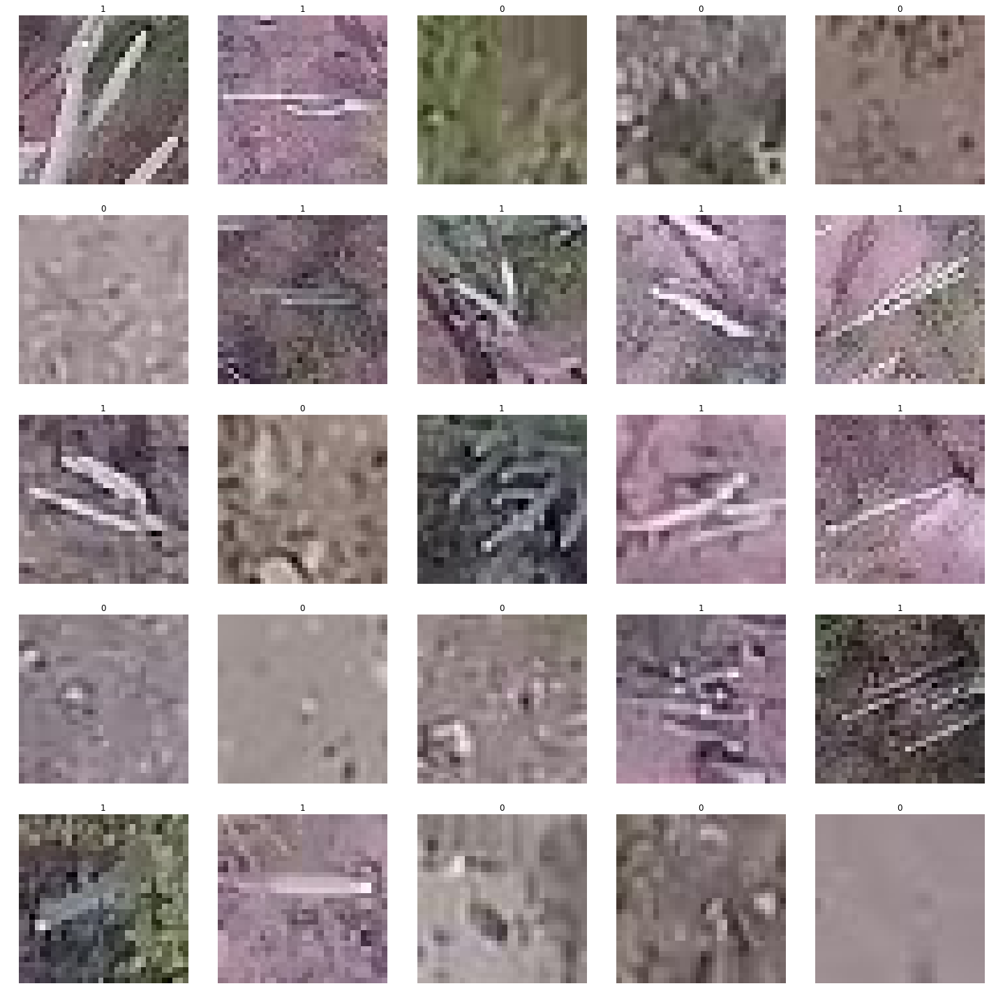
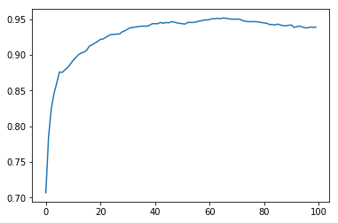

+++
# Project title.
title = "Aerial Cactus Identification"

# Date this page was created.
date = 2019-12-25T00:00:00

# Project summary to display on homepage.
summary = "Approaches and code for identifying cacti from satellite images"

# Tags: can be used for filtering projects.
# Example: `tags = ["machine-learning", "deep-learning"]`
tags = ["Deep Learning" , "Computer Vision"]

# Optional external URL for project (replaces project detail page).
external_link = ""

# Slides (optional).
#   Associate this project with Markdown slides.
#   Simply enter your slide deck's filename without extension.
#   E.g. `slides = "example-slides"` references 
#   `content/slides/example-slides.md`.
#   Otherwise, set `slides = ""`.
slides = ""

# Links (optional).
url_pdf = ""
url_slides = ""
url_video = ""
url_code = ""

# Custom links (optional).
#   Uncomment line below to enable. For multiple links, use the form `[{...}, {...}, {...}]`.
 

# Featured image
# To use, add an image named `featured.jpg/png` to your project's folder. 
[image]
  # Caption (optional)
  caption = ""
  
  # Focal point (optional)
  # Options: Smart, Center, TopLeft, Top, TopRight, Left, Right, BottomLeft, Bottom, BottomRight
  focal_point = "TopLeft"
+++

This was one my of very first competitions. While doing [Practical Deep Learning for Coders](https://course.fast.ai/), this competition provided a good source of practise. It was a binary classification problem. The goal for this competition was to determine whether the given satellite image contained a columnur cactus. 

I used this dataset for two purposes :

1. To implement and test [ArcFace](https://arxiv.org/pdf/1801.07698.pdf) using pytorch.
2. To get placed into a high LeaderBoard position in the competition using FastAI.

## Approach

### EDA 
According to the dataset details, the images were taken from the air. The images are low-res, some of them rotated to arbitrary angles and some zoomed. From visual inspection, the cacti are somewhat easy to spot because of their unique texture and stick-like shape. The class imbalance is not severe, can be handled by data augmentation.

### Data split and Transforms
#### Split 
As the class imbalance was not servere, the data could be split into train/valid set at random.
#### Transforms 
Following Transforms were applied with 75% probability to augment the data, then the images were resized to 128*128. Test time augmentation was not applied.  

1. Horizontal Flip
2. Vertical Flip
3. Left and Right rotation upto 10°
4. Upto 110% zoom

### Hyperparameters
#### ArcFace

1. s = 64
2. m = 0.0
3. Adam Optimizer with fixed lr = 1e-3

#### Competition Classifiers 
##### Densenet169
1. Frozen model, Adam optimizer with maximum lr = 7.5e-3.
2. CyclirLR scheduler
3. Unfrozen model, Adam optimizer with maximum lr = 1e-6.

##### Resnet101
1. Frozen model, Adam optimizer with maximum lr = 9e-3.
2. CyclirLR scheduler
3. Unfrozen model, Adam optimizer with maximum lr = 1e-6.

### Model Performance
I used DenseNet169 and Resnet101 for Leaderboard and ArcFace for research purposes.

### ArcFace
ArcFace was applied on the Resnet101 backbone. Implemented from scratch in pytorch. With embedding dimension = 2048 and scale_factor (s) = 64, accuracy follows :

Further experimentation using additional linear layers can boost the results. Then again, this approach is designed for one-shot learning. Worse performance in Binary Classification is quite understandable.
#### DenseNet169
Densenet169 needs more time to converge because of its enormous size and paramters. 

| epoch 	| train_loss 	| valid_loss 	| error_rate 	| accuracy 	|  time 	|
|:-----:	|:----------:	|:----------:	|:----------:	|:--------:	|:-----:	|
|   0   	|  0.059754  	|  0.004154  	|  0.000000  	| 1.000000 	| 01:35 	|
|   1   	|  0.062731  	|  0.000837  	|  0.000000  	| 1.000000 	| 01:29 	|
|   2   	|  0.019187  	|  0.003954  	|  0.000000  	| 1.000000 	| 01:29 	|
|   3   	|  0.009922  	|  0.000457  	|  0.000000  	| 1.000000 	| 01:26 	|
|   4   	|  0.004491  	|  0.000055  	|  0.000000  	| 1.000000 	| 01:27 	|
#### Resnet101
Resnet101 needed less time to converge. 

| epoch 	| train_loss 	| valid_loss 	| error_rate 	| accuracy 	|  time 	|
|:-----:	|:----------:	|:----------:	|:--------:	|:----------:	|:--------:	|
|   0   	|  0.063169  	|  0.033260  	|  0.011429  	| 0.988571 	| 01:17 	|
|   1   	|  0.034835  	|  0.002770  	|  0.000000  	| 1.000000 	| 01:15 	|
|   2   	|  0.024171  	|  0.002123  	|  0.000000  	| 1.000000 	| 01:15 	|
|   3   	|  0.014281  	|  0.006416  	|  0.005714  	| 0.994286 	| 01:14 	|
|   4   	|  0.006923  	|  0.002465  	|  0.000000  	| 1.000000 	| 01:13 	|

## Competition Standings

My models acheived perfect accuracy score in the public leaderboard.
<form action="https://github.com/abyaadrafid/Aerial-Cactus-Identification">
    <input type="submit" formtarget = "_blank" value="Github Repo" />
</form>