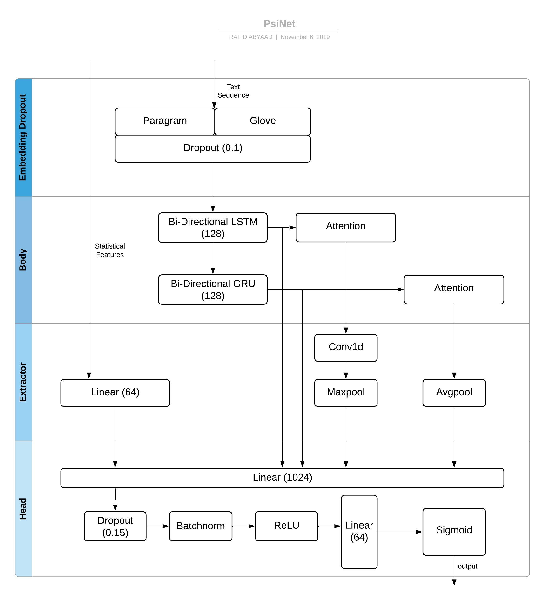

+++
# Project title.
title = "Quora Insincere Questions Classification"

# Date this page was created.
date = 2019-12-25T00:00:00

# Project summary to display on homepage.
summary = "Approaches and codes for short-text binary classification"

# Tags: can be used for filtering projects.
# Example: `tags = ["machine-learning", "deep-learning"]`
tags = ["Deep Learning" , "Natural Language Processing"]

# Optional external URL for project (replaces project detail page).
external_link = ""

# Slides (optional).
#   Associate this project with Markdown slides.
#   Simply enter your slide deck's filename without extension.
#   E.g. `slides = "example-slides"` references 
#   `content/slides/example-slides.md`.
#   Otherwise, set `slides = ""`.
slides = ""

# Links (optional).
url_pdf = ""
url_slides = ""
url_video = ""
url_code = ""

# Custom links (optional).
#   Uncomment line below to enable. For multiple links, use the form `[{...}, {...}, {...}]`.
 

# Featured image
# To use, add an image named `featured.jpg/png` to your project's folder. 
[image]
  # Caption (optional)
  caption = ""
  
  # Focal point (optional)
  # Options: Smart, Center, TopLeft, Top, TopRight, Left, Right, BottomLeft, Bottom, BottomRight
  focal_point = "TopLeft"
+++

The problem for this competition was text binary classification. The goal of this competition was to develop a model that can flag potentially toxic/insincere questions. Being a kernel-only competition, models available memory and execution time was limited for submissions. I developed a model and submitted it to the competition after it had ended. The submissions placed me at :

  * Public LB  : Top 50
  * Private LB : Top 100
  

## Aproach
### EDA
Initial EDA of the data revealed the dataset to be very imbalanced. Around 96% of the data was from one class and the rest from the other. So accuracy as a metric was useless in this particular competition. The evaluation criteria was to maximized F-score, rightly so.
### Text Preprocessing and Loading
The competition provided word embedding files. To use the word embeddings, I needed to make sure that word coverage is as much as possible. That meant I needed to fix word misspellings and typos. Glove and Paragram word embeddings do not include many punctuations present in the dataset, so I needed to remove them as well.
#### Processing Steps 

1. Cleaning Text from numbers and Punctuations
2. Replacing typical misspellings and typos
3. Filling blank questions with special tokens
#### Crafting Meta Features
Based on some EDA, these features are extracted from the train data :

1. Total length
2. Capitals
3. Ratio of capitals and length
4. Number of words
5. Number of unique words
6. Ratio of unique words and total words
#### Tokenization 
I used keras tokenizer. All out of vocabulary words will be replaced with special 'xxunk' token. Tokenizer is fit on the train data and used to make sequence of texts. Then the sequences are padded so all of them have the same length. Longer sequences are truncated and shorter ones are padded.
#### Scaling Statistical Features
Calculated Statistical Features will have to be scaled before putting through a neuralnet.

As because these features have different ranges for values, some features may produce vanishing gradients. For example number of words will be, on average, a way larger value than number of unique words. So, these feaures are scaled using a standard scaler.

### Loading Embeddings
I have used paragram and glove embeddings in the model. As these word embeddings were not trained in exactly the same system, some useful information may be lost if a weighted average is used. That is why, I have concatenated them into a num_words * (embedding_dim * num_embedding) matrix.

Using more embeddings may end up giving more generalization but these models are quite memory intensive and used all my ram. So I couldn't use more than two of them.

### Model Definition
#### Modules
Following Modules contruct the model :

1. Embedding and Dropout
2. LSTM+GRU backbone
3. Attention Block
4. Extractor/ Merge Layer
5. Output/ Head

#### Embedding and Dropout
This layer takes truncated sequence of tokenized texts as input and provides a 2d array as output.
In my case I limited 120000 as the maximum number of unique features to use. A dropout of 10% was applied. This module returns an array of size (120000 * 300 * 2)
#### LSTM+GRU and Attention Backbone
The main body of the model consists of bidirectional LSTM and GRU (128).
The body returns LSTM+GRU outputs and Attention-transformed LSTM+GRU outputs.
#### Extractor/ Merge
This layer serves as the feature extractor for lstm, gru outputs and statistical Meta features.
Conv1d is applied on lstm output, which goes into a maxpool. GRU output is sent through avgpool. Statistical Features are put through a Linear layer.
#### Output Layer
This layer consists of a dropout, a relu and a batchnorm layer, sandwiched between two linear layers. The last linear layer provides the output of the model as a score for the input.

### Complete Model

1. First input is sent through embedding layer, returning feature vectors.
2. Embedding output is then passed to the Body of the model.
3. Extractor layer is used to find features from the sequential output of the model backbone.
4. Attention infused lstm+gru outputs and extracted features are concatenated.
5. Concatenated features are sent to the output layer.

### Training the model
The model was trained 5 epochs with Stratified 5-fold-cross-validation. Adam optimizer with 0.01 learning rate and ExponentialLR scheduler was used.

### Best threshold for classification
The sigmoid value provided by the model is a continuous representation of insincerity in the inputs. We need a specific threshold to separate the two classes. The best threshold was calculated on the training data, then it was applied on the test data. Based on the threshold of the score, test data was classified and submitted.

<form action="https://github.com/abyaadrafid/Quora-Insincere-Question-Classification">
    <input type="submit" formtarget = "_blank" value="Github Repo" />
</form>